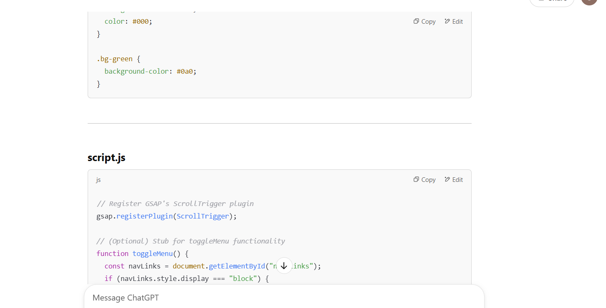

# AprilSonata

April Sonata
Our project is selling instruments that are made with organic materials. Our violins and pianos are the top best seller and our signature instruments. Users are able to have many benefits in our project as they are able to learn courses, free access to music scores, take a quiz to find which instrument they are best suited for. Additionally, 10% of user's purchase goes to preserving wildlife.  There is an infographic page at About Us which shows and tells more information about our brand.
Our aim of our project is to provide free online education for music and providing affordable instruments to everyone.  Providing many benefits to our website.

Who this website is for:
As a consumer, I wish to buy instruments at the cheapest and most affordable price, so I go to April Sonata to get them where it is cheapest in market
As someone who loves wildlife, I wish to preserve wildlife, so I go to April Sonata and support them by buying any listing so I can save the wildlife further.
As someone who really wants to learn more about music but classes are too expensive, I can rely on April Sonata's free courses and learn my theory from there.
As someone who cannot write their own scores neither want to pay anybody for music scores can rely on April Sonata free music sheets displayed there with many different genres of music.

Existing Features: 
1. Shop now feature- allows users to have quick access to product page by having them click on the button
2. Quiz button - brings users to quiz page to find out which instruments suits them the most
3. website carousel ( image slide show) - helps to keep visitors/users interested and would be a dynamic way to narrate some of April Sonata's offerings
4. About Us - provides users with more information about the brand such as the green musician series and whats our mission or values
5. Free courses - allows users to learn music related courses for free to improve their skills
6. feature highlights ( 4 boxes of information in home page): basically summarises the things that the website has to offer
7. Music scores - allows users to access free music scores for different genres of music

Future features left to be implemented:
likes- allows users to like any instruments so that they can always look back at it
comment- allows users to comment on any instruments so that they can share their thoughts with others
review- allows users to review any instruments so that they can share their experience with others
search bar- allows users to search for any instruments so that they can find what they are looking for

Technologies used:
https://www.w3schools.com/howto/howto_js_portfolio_filter.asp
this was used for easier filtering of products 

https://www.w3schools.com/howto/howto_css_hero_image.asp
used to manage the design of the contact us section under home page

https://www.w3schools.com/howto/howto_js_slideshow.asp
template for home page carousel 

Assertive Ai:
ChatGPT 
https://www.w3schools.com/howto/default.asp
https://www.w3schools.com/howto/howto_html_favicon.asp
https://www.w3schools.com/howto/howto_js_portfolio_filter.asp
https://www.w3schools.com/howto/howto_css_hero_image.asp
About us 
  

Testing:

Credits.

Media: 
The photos used in this site were obtained from 
Guitar: https://www.sweelee.com.sg/search?query=guitar 
https://www.soundalchemy.com.sg/
Pianos: https://shop.sg.yamaha.com/products/pianos.html?brand=Peacock
Violin: https://www.swstrings.com/catalog/instruments/violin

Received inspiration for this project from Swee Lee